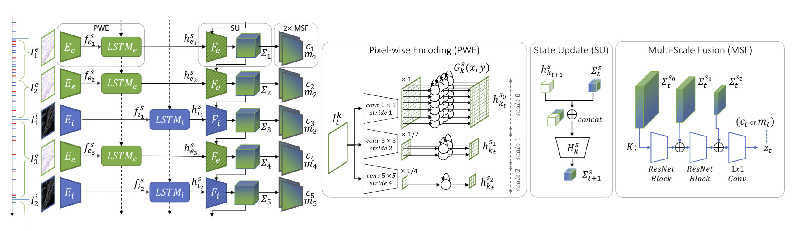

[comment]: <> (# RAMP-VO)

<!-- PROJECT LOGO -->

  <h1 align="center"> RAMP-VO (复现及中文注释版~仅供个人学习记录用)
  </h1>

[comment]: <> (  <h2 align="center">PAPER</h2>)
  <h3 align="center">
  <a href="https://rpg.ifi.uzh.ch/docs/IROS24_Pellerito.pdf" target="_blank">Paper</a> 
  | <a href="https://github.com/uzh-rpg/rampvo" target="_blank">Original Github Page</a>
  </h3>
  

  

# 配置过程记录
* 创建conda环境
~~~
<!-- rm -rf .git -->

conda env list
conda remove -n rampvo --all

conda env create -f environment.yml
conda activate rampvo 

<!-- 下面用于检查安装的torch版本 -->
python -c "import torch; print(torch.__version__)"

<!-- 手动安装torch -->
conda install pytorch==1.12.0 torchvision==0.13.0 torchaudio==0.12.0 cudatoolkit=11.6 -c pytorch -c conda-forge
~~~

* 下载eigen
~~~
wget https://gitlab.com/libeigen/eigen/-/archive/3.4.0/eigen-3.4.0.zip
unzip eigen-3.4.0.zip -d thirdparty
~~~

* 安装Ramp VO
~~~
pip install .
~~~